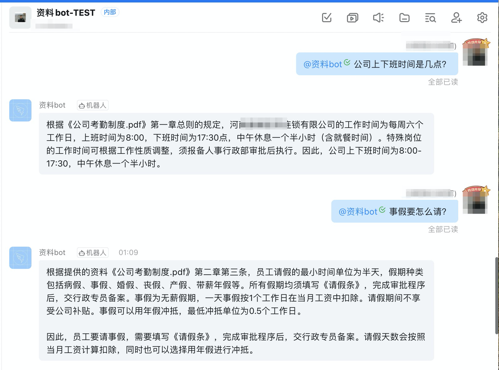

# 基于OpenAI的私有资源库问答系统

## 软件概要

本软件是一个基于OpenAI的私有资源库问答系统，旨在为企业提供智能化的内部资源检索或客服问答工具。该软件可独立部署，适用于各种企业规模和行业。

场景举例：

场景A：内部资料检索。企业可将内部资料（如员工手册、企业知识等）上传至系统，员工可通过问答方式迅速获取所需内容，提高工作效率和准确性。

场景B：智能客服。企业可将用户手册、客户FAQ等内容上传至系统，系统可根据内容自动回答客户的问题，提高客户满意度和服务效率。

## 安装说明 (基于docker compose)

### 1.设置OPENAI_API_KEY
获取本项目源代码, 在docker-compose.yml中填找到OPENAI_API_KEY, 填写你的key。
```
OPENAI_API_KEY: sk-xxxx
```
若还没有自己的key，请在这里获取 [OpenAI API Keys](https://platform.openai.com/account/api-keys)

### 2.启动docker compose

```
 docker-compose up
```

### 3.访问

访问地址：http://127.0.0.1:3000  

上传txt或pdf文件，然后在对话框询问即可。


## Demo站：

PC端: [http://www.chatmylib.xyz](http://www.chatmylib.xyz)  

手机端: [http://www.chatmylib.xyz/mobile](http://www.chatmylib.xyz/mobile)


## 对接钉钉机器人
将问答系统对接到内部钉钉群里，通过 @机器人 与之对话，获得资料信息。效果如下图：



配置步骤见 [对接钉钉机器人](docs/dingtalk_integration_guide.md)


## 备注

本软件前端页面引用了 [xqdoo00o/chatgpt-web](https://github.com/xqdoo00o/chatgpt-web) 的部分代码。

给产品提意见和建议点击这里：<a href="https://support.qq.com/product/538086" target="_blank">反馈</a>

联系作者: 发邮件到 12060198@qq.com

## FAQ

[服务器无法访问https://api.openai.com/v1 怎么办？](docs/faq/openai_api_base.md)

 