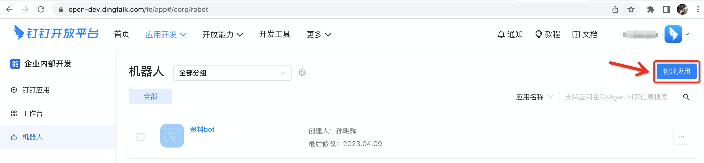
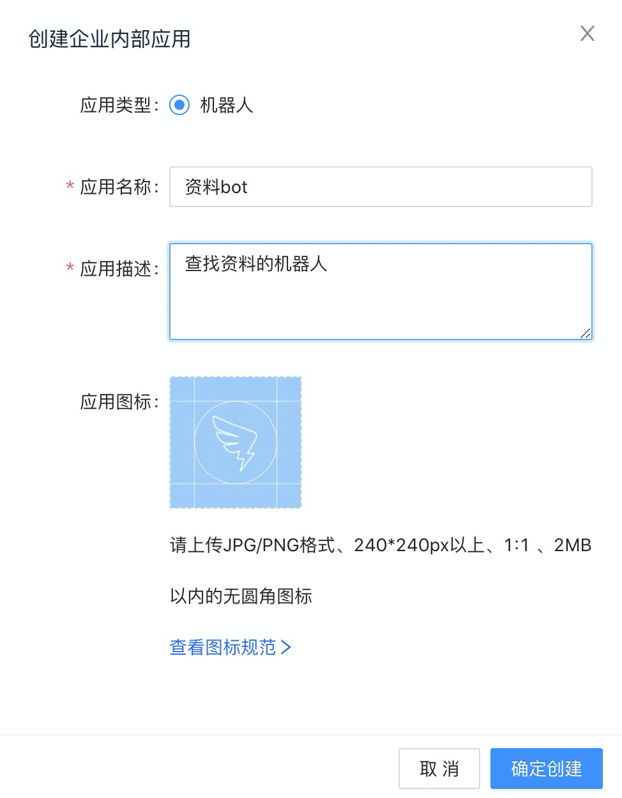
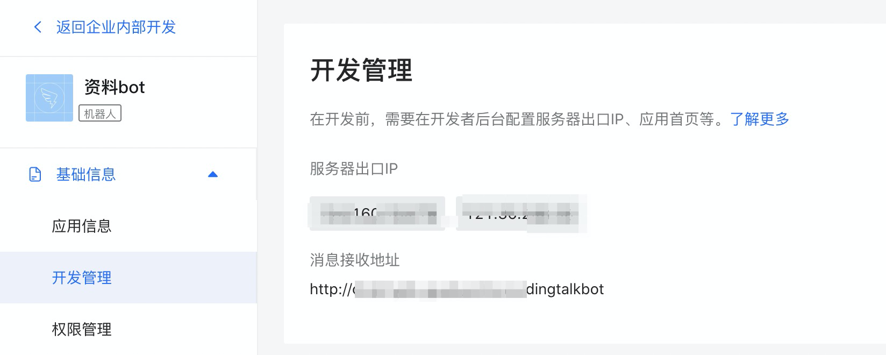
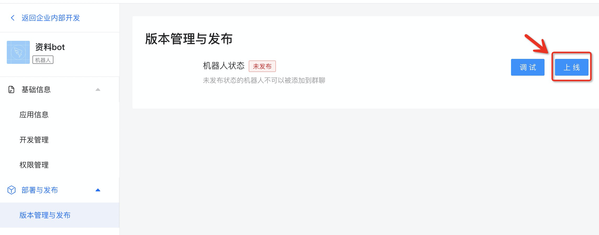
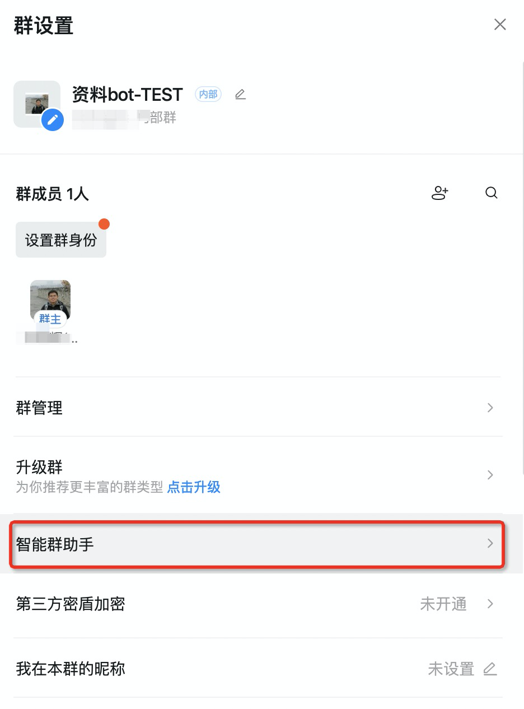
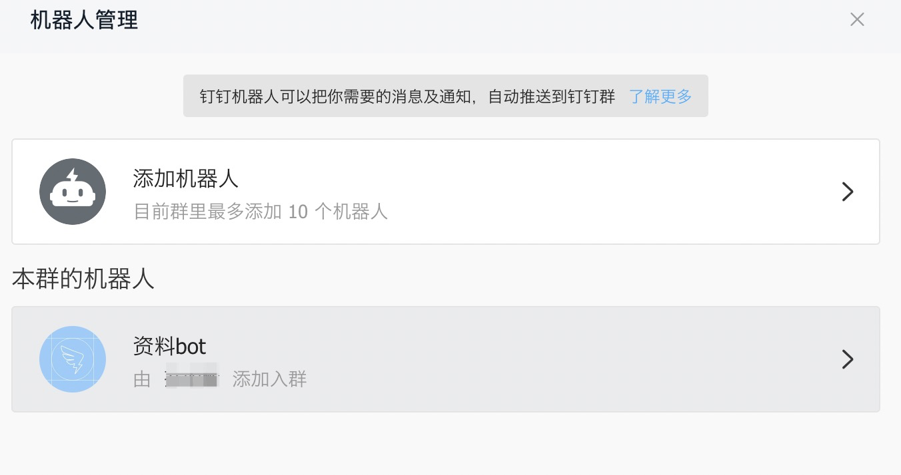
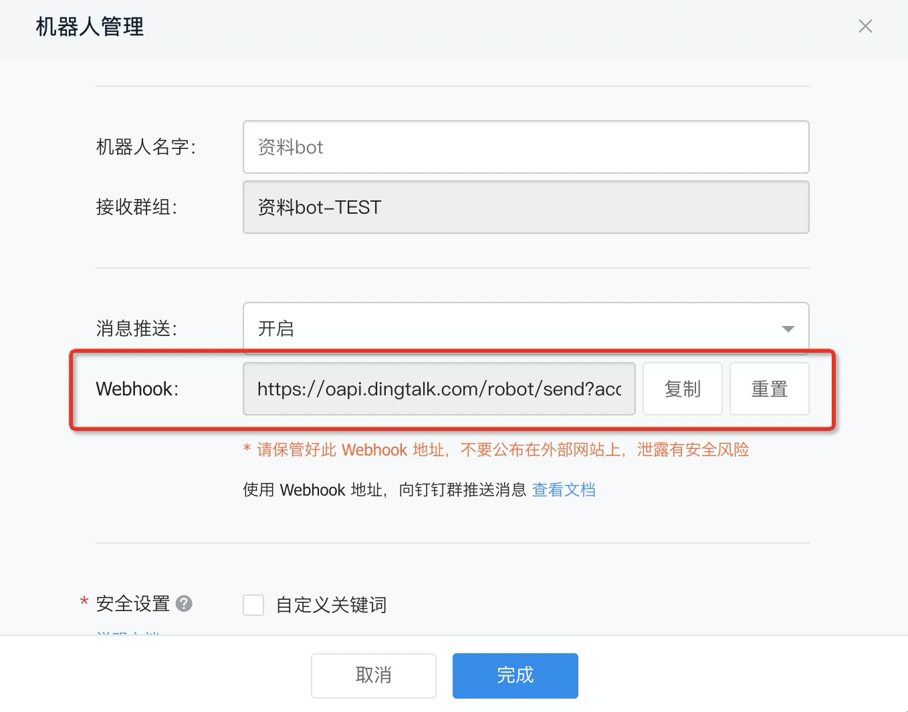
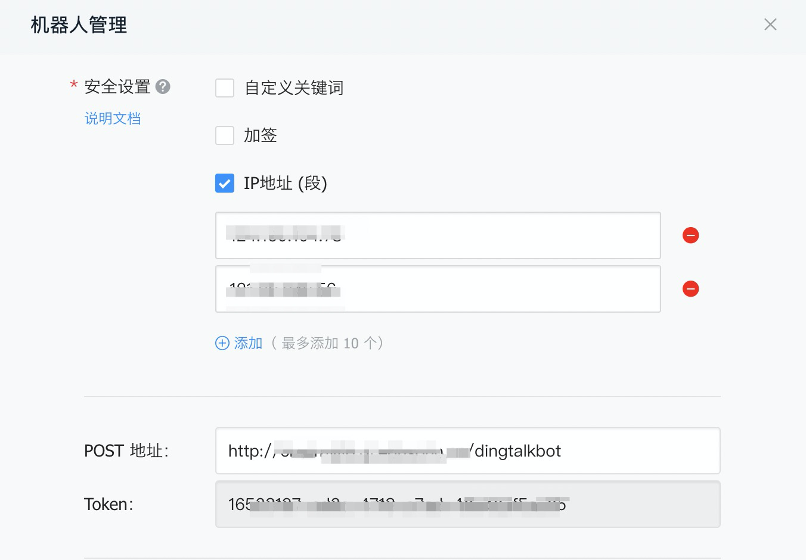

# 基于OpenAI的私有资源库问答系统

## 软件概要

本软件是一个基于OpenAI的私有资源库问答系统，旨在为企业提供智能化的内部资源检索或客服问答工具。该软件可独立部署，适用于各种企业规模和行业。

场景举例：

场景A：内部资料检索。企业可将内部资料（如员工手册、企业知识等）上传至系统，员工可通过问答方式迅速获取所需内容，提高工作效率和准确性。

场景B：智能客服。企业可将用户手册、客户FAQ等内容上传至系统，系统可根据内容自动回答客户的问题，提高客户满意度和服务效率。

## 安装说明

### 1.安装python 3.10版本
略

### 2.安装python依赖

```
pip install -r requirements.txt
```

### 3.安装Qdrant向量数据库

```
docker run -p 6333:6333 -v $(pwd)/qdrant_storage:/qdrant/storage qdrant/qdrant
```

### 4.安装MySQL数据库

先安装mysql-server(以ubuntu系统为例)
```
sudo apt install mysql-server
```

再执行/scripts目录下的脚本，创建数据库和表。

### 5.设置OPENAI_API_KEY环境变量

```
export OPENAI_API_KEY={你的OPENAI_API_KEY}
```

### 6.配置参数

复制文件.env.dist 为 .env，修改文件里的相关参数，如配置MySQL用户名/密码等

### 7.运行

```
python server.py
```

### 8.访问

访问地址：http://localhost:3000  

上传txt或pdf文件，然后在对话框询问即可。


### 9.Demo站：

PC端: [http://www.chatmylib.xyz](http://www.chatmylib.xyz)  

手机端: [http://www.chatmylib.xyz/mobile](http://www.chatmylib.xyz/mobile)

## 备注

本软件前端页面引用了 [xqdoo00o/chatgpt-web](https://github.com/xqdoo00o/chatgpt-web) 的部分代码。

给产品提意见和建议点击这里：<a href="https://support.qq.com/product/538086" target="_blank">反馈</a>

联系作者: 发邮件到 12060198@qq.com

## 对接钉钉机器人

### 创建机器人应用

* 访问钉钉后台： https://open-dev.dingtalk.com/fe/app#/corp/robot ， 创建应用


* 填写机器人信息 


* 记录应用信息中的 AppSecret


* 填写服务器出口IP和消息接收地址

接收地址为 http://<host>:<port>/dingtalkbot



* 上线机器人



* 找一个钉钉内部群，【设置】-【智能群助手】



* 添加刚创建的机器人



* 记录Webhook地址，填写IP段和POST地址

其中POST地址为：http://<host>:<port>/dingtalkbot



* 上述步骤完成后，在群可以看到机器人。@机器人，并问它问题即可。